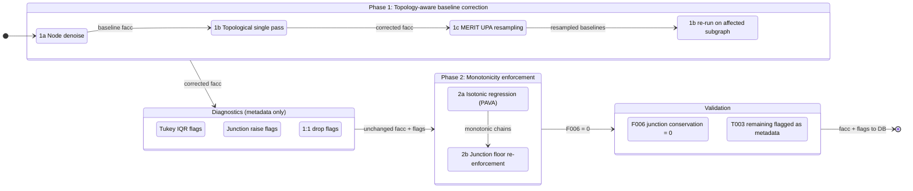

# Flow Accumulation Correction: Technical Report

**SWORD v17c** | February 2026 | Gearon, Pavelsky

---

## 1. Problem: Why v17b Facc Has Errors

SWORD's flow accumulation (`facc`, km^2) is extracted from MERIT Hydro's **UPA (upstream area)** raster. UPA is derived from a **D8 (deterministic eight-neighbor)** flow direction algorithm, which routes all flow from each raster cell to exactly one downhill neighbor. The D8 directions determine the UPA values: each cell's UPA is the total area of all cells that drain through it under D8 routing. This single-flow-direction raster fundamentally conflicts with SWORD's multi-channel vector network topology, producing three systematic error modes in the UPA values that SWORD samples.

### 1.1 Bifurcation Cloning

When a river splits into two or more channels, D8 routes all flow to one neighbor, so UPA has no mechanism to partition drainage area. Every child channel's UPA value reflects the full parent drainage:

```
        Parent (facc = 1,089,000 km^2)
        /                              \
  Child A (facc = 1,089,000)    Child B (facc = 1,089,000)
```

The correct values should be proportional to channel width. If Child A carries 60% of the flow (by width), it should have ~653,000 km^2 and Child B ~436,000 km^2. Instead, both get the full 1,089,000 km^2.

**Scale**: ~2,910 bifurcation points globally across 248,674 reaches.

### 1.2 Junction Inflation

When cloned channels rejoin at a downstream junction, their facc values are naively summed:

```
  Child A (1,089,000) + Child B (1,089,000)  ->  Junction (2,178,000)
```

The junction should have ~1,089,000 km^2 plus any lateral drainage between the bifurcation and junction. This double-counting propagates downstream: every reach below inherits the inflated value. In complex deltas with nested bifurcation-junction pairs, inflation compounds exponentially. The Lena River delta (73 bifurcations, 107 junctions) reached 1.65 billion km^2 under naive correction — 674x the real 2.49M km^2 basin area.

**Scale**: ~18,000 junction deficit violations in v17b.

### 1.3 Raster-Vector Misalignment

SWORD's vector reaches and MERIT's UPA raster cells don't align perfectly. When a reach's node sampling point falls on a neighboring UPA flow path, the sampled facc can be 2-50% lower than the upstream reach's facc — a physical impossibility on a non-bifurcating channel. These are random drops on 1:1 links (single parent, single child), not topology errors.

**Scale**: ~8,000 1:1-link drops globally.

### 1.4 Concrete Example

In the Ganges delta, UPA assigns 1,089,000 km^2 to every distributary child — the full upstream basin area — because D8 cannot split flow. Width-proportional splitting would give the main channel ~650,000 km^2 and secondary channels proportionally less. Without correction, downstream junctions double-count, and the error cascades through hundreds of downstream reaches.

---

## 2. The Integrator Approach (DrainageAreaFix)

A colleague developed a constrained optimization approach using CVXPY. The formulation solves for incremental (local) drainage areas per reach:

### Formulation

```
minimize  ||W(Ax - L)||^2
subject to  x >= 0
            A[anchors,:] @ x == L[anchors]  (optional hard constraints at gauge reaches)
```

Where:
- **x** = vector of incremental drainage areas (one per dependent reach)
- **A** = upstream adjacency matrix encoding junction/bifurcation connectivity
- **L** = observed facc minus sum of independent (headwater) facc
- **W** = diagonal weight matrix, iteratively downweighting Tukey IQR outliers

The solver (OSQP/ECOS via CVXPY) minimizes weighted least-squares deviation from observed UPA values subject to non-negativity on incremental areas. Optional hard anchors pin specific reaches (e.g., gauged sites) to their observed values.

### Test Results

Applied to the Willamette River basin: 55 total reaches (52 dependent, 3 independent). Converged in 1 iteration with 1 outlier identified. All incremental areas non-negative. Runtime: <1 second.

### Scalability

The approach requires manual basin delineation, junction identification, and constraint setup per basin. Matrix factorization is O(m^2)-O(m^3) per basin, where m is the number of dependent reaches. Tested on a single 55-reach basin; applying globally to 248K reaches would require delineating and processing thousands of basins individually.

---

## 3. Our Approach: v3 Denoise Pipeline

### Same Goal, Different Formulation

Both approaches enforce conservation (downstream facc >= sum of upstream facc) and non-negativity (no negative incremental drainage). We achieve this via a topological-order single-pass algorithm that processes the entire global network without manual basin setup.

### Lint Checks Referenced

The pipeline targets specific violations detected by our [lint framework](../src/updates/sword_duckdb/lint/CHECKS.md) (see Section 6 for full results):

| Check | What it tests |
|-------|---------------|
| **T003** | Facc monotonicity — downstream facc < upstream facc on non-bifurcation edges |
| **F006** | Junction conservation — facc < sum(upstream facc) at junctions with 2+ inputs |
| **F007** | Bifurcation balance — children facc don't sum to parent facc |
| **F012** | Non-negative incremental area — facc < sum(upstream facc) at any reach |

### Pipeline Phases

The pipeline has two correction phases plus a diagnostic step:

- **Phase 1** — Topology-aware baseline correction (node initialization, topological pass, MERIT UPA resampling)
- **Phase 2** — Monotonicity enforcement (isotonic regression on 1:1 chains, junction floor re-enforcement)
- **Diagnostics** — Outlier flagging (metadata only, no facc changes)



#### Phase 1 — Topology-aware baseline correction

##### Phase 1a — Baseline initialization

Each reach has ~10-50 nodes spaced ~200m apart, each independently sampling the MERIT Hydro UPA raster. Normally we take `MAX(node facc)` as the reach's baseline facc, since drainage area is highest at the downstream end. But some nodes' sampling points land on an adjacent UPA flow path (a parallel tributary or different branch), returning a facc value that has nothing to do with the reach's actual river. We detect this by comparing `MAX(node facc)` to `MIN(node facc)` within each reach: on a ~2-10 km segment, facc should vary by a few percent at most, so `MAX/MIN > 2.0` indicates at least one node hit a wrong UPA cell. For these noisy reaches, we use the downstream-most node's facc (the most physically meaningful sample, since it sits at the reach's connection point to the next reach) instead of `MAX`. This affects ~7,345 reaches (3.0%) globally and removes the noise source before topology correction.

**Assumptions:**
- The downstream-most node is the most reliable UPA sample, because it sits at the reach's physical connection to the next reach.
- A within-reach facc ratio > 2.0x indicates raster misalignment, not real drainage variation over a ~2-10 km segment.
- v17b node-level data is the uncorrupted source (we read from v17b, not v17c, which may have been modified).

##### Phase 1b — Topological single pass

Process all reaches in topological order (headwaters first, outlets last). This guarantees that every reach's upstream neighbors are already corrected before we visit it. We define two values per reach: the **baseline** (facc from Phase 1a, before any topology correction) and the **corrected** value (the output of this phase). Five cases:

**Headwaters** (no upstream neighbors): Keep the baseline facc. Nothing upstream to correct against.

**Junctions** (2+ upstream parents): `corrected = sum(corrected_upstream) + lateral`. The **lateral increment** is the local drainage that enters between the upstream reaches and this junction — hillsides, small creeks, etc. not captured as separate SWORD reaches. It is computed as: `lateral = max(baseline - sum(baseline_upstream), 0)`.

In the normal case (no UPA errors), the baseline junction value is slightly larger than the sum of the baseline upstream values, and the difference is real local drainage:

```
  River A (baseline 100,000 km²)  ──┐
                                     ├─→  Junction (baseline 160,000 km²)
  River B (baseline  50,000 km²)  ──┘

  sum(baseline_upstream) = 150,000
  lateral = max(160,000 - 150,000, 0) = 10,000  (real local drainage)
  corrected = sum(corrected_upstream) + 10,000
```

When UPA cloning is present (D8 assigned the full parent drainage to both children), the upstream baselines are inflated, and `sum(baseline_upstream)` exceeds the junction baseline. The lateral goes negative, which would mean "drainage leaves at this junction" — physically impossible. The `max(..., 0)` clamp catches this:

```
  Channel A (baseline 200,000 km²)  ──┐  ← cloned, should be ~120K
                                       ├─→  Junction (baseline 210,000 km²)
  Channel B (baseline 200,000 km²)  ──┘  ← cloned, should be ~80K

  After correcting bifurcation children: A=120K, B=80K
  sum(baseline_upstream) = 400,000  (inflated)
  lateral = max(210,000 - 400,000, 0) = 0  (clamp catches negative)
  corrected = 200,000 + 0 = 200,000
```

The tradeoff: in the clone case we lose the real ~10K lateral drainage (zeroed along with the inflation). Phase 2 (isotonic regression) can recover small losses like this.

**Bifurcation children** (parent has 2+ downstream children): `corrected = corrected_parent * (width_child / sum_sibling_widths)`. Instead of every child getting 100% of the parent's facc (the UPA cloning error), each child gets its share proportional to channel width. If a child has no width data, children split equally as a fallback.

**1:1 links where the parent was lowered** (parent's corrected < parent's baseline, meaning a bifurcation split propagated down to it): `corrected = corrected_parent + max(baseline - baseline_parent, 0)`. This is the same lateral-increment logic as junctions, and it matters because bifurcation corrections need to propagate. When a bifurcation split lowers a parent's facc, the child on a 1:1 link should inherit that lower value — otherwise the correction stops at the first reach downstream and the rest of the river still carries the inflated UPA value.

```
  Bifurcation parent (baseline 1,000,000 km²)
       |
       ├── Child A (60% width share) → corrected to 600,000
       └── Child B (40% width share) → corrected to 400,000
              |
              Reach X (1:1 link, baseline 410,000 km²)

  Parent was lowered: corrected (400K) < baseline (1,000K)
  baseline_parent = 1,000,000
  lateral = max(410,000 - 1,000,000, 0) = 0  (child baseline < parent baseline)
  corrected_X = 400,000 + 0 = 400,000
```

The lateral is zero here because Reach X's baseline (410K) is less than the parent's baseline (1M) — there's no evidence of new drainage entering. But if Reach X had a baseline of 1,050,000 (50K of real local drainage beyond the parent), the formula would preserve it: `corrected = 400,000 + max(1,050,000 - 1,000,000, 0) = 450,000`.

**Lowering cascades downstream**: every subsequent 1:1 reach applies the same rule, so the bifurcation split propagates all the way down the chain until it hits a junction or another bifurcation.

**1:1 links where the parent was raised** (parent's corrected >= parent's baseline, meaning a junction floor pushed it up): Keep the baseline. **Raising does NOT cascade.** This asymmetry is the key innovation. If junction-floor raises cascaded downstream, a +50,000 km² raise would propagate to every downstream reach; when it hits the next junction, it doubles, then doubles again. This exponential inflation is what caused the Lena River delta to reach 1.65 billion km² in our v1 attempt (real basin: 2.49M km²).

**Assumptions:**
- The SWORD topology graph is a DAG (directed acyclic graph) so topological sort is valid.
- Channel width is a reasonable proxy for flow partitioning at bifurcations.
- Negative lateral drainage is always a UPA artifact (from D8 cloning), never real physics.
- Junction-floor raises should not propagate, because they reflect corrections to local accounting errors, not changes to actual upstream drainage.

**After Phase 1b**, bifurcation children have width-proportional shares instead of cloned UPA values, junctions satisfy conservation (facc >= sum of upstream), and lowered values have propagated through 1:1 chains. However, residual UPA noise remains: some 1:1 links still have downstream facc < upstream facc (monotonicity violations) from raster-vector misalignment that Phase 1a didn't catch, and some junctions may be over-floored by partially inflated upstream branches. Phase 1c (optional) and Phase 2 address these residuals.

##### Phase 1c — MERIT UPA resampling

Phase 1c targets remaining T003 violations on 1:1 links — reaches where downstream facc < upstream facc after Phase 1b. For each violating downstream reach, the pipeline tries three strategies to find a better UPA value:

1. **UPA walk A** (primary): From the downstream reach's upstream endpoint, walk downstream along MERIT's D8 flow direction for up to 150 cells (~13.5 km at 90m resolution). This snaps to MERIT's actual thalweg, bypassing the offset between SWORD's junction point and MERIT's confluence cell.
2. **UPA walk B** (secondary): Same walk from the upstream reach's downstream endpoint — covers the other side of the junction.
3. **Radial buffer** (fallback): If neither UPA walk fixes monotonicity, sample UPA in a buffer (500m–5km, scaled to reach width) around the junction point.

The selection rule: pick the **minimum UPA >= corrected upstream** (fixes the violation with least distortion). If none exceeds the target, pick the maximum candidate (reduces the gap).

After resampling, the updated baseline values feed a **re-run of Phase 1b** on the affected downstream subgraph — all reaches downstream of any resampled reach are re-processed in topological order to propagate the improved values.

Globally, ~1,651 reaches are resampled (`upa_resample` correction type).

#### Phase 2 — Monotonicity enforcement

##### Phase 2a — Isotonic regression on 1:1 chains (PAVA)

After Phase 1, some 1:1 chains still have monotonicity violations (downstream facc < upstream facc) from residual UPA noise. Phase 2a smooths these out.

First, extract **1:1 chains**: maximal sequences of reaches where each reach has exactly one upstream neighbor and that neighbor has exactly one downstream child. Chains start at headwaters, junction outputs, or bifurcation children, and end at the next junction, bifurcation, or outlet. These are the "simple pipe" segments between topology branch points.

For each chain with violations, run the **Pool Adjacent Violators Algorithm (PAVA)** in log-space to find the closest non-decreasing sequence (minimizing sum-of-squared deviations). This adjusts values both up and down — unlike Phase 1b which only lowers or floors. Bifurcation children (chain heads that received a width-proportional share in Phase 1b) are anchored at 1000x weight so isotonic regression preserves their corrected values. Junction feeders (chain tails feeding into a junction) are NOT anchored, enabling the regression to lower them if needed.

This adjusts ~36,915 reaches globally.


*Figure 5. PAVA in action on a 15-reach 1:1 chain in South America. The red line (Phase 1 output) has a clear violation zone where facc decreases from R8 to R14. PAVA (blue) creates a flat "pool" through the drop — the closest non-decreasing fit — then rises to meet the downstream values. The shaded regions mark where facc was decreasing (violations). PAVA adjusts values both up and down to minimize total distortion while guaranteeing monotonicity.*

**Assumptions:**
- Facc should be non-decreasing along any 1:1 chain (drainage area can only grow or stay constant going downstream on a non-bifurcating channel).
- Log-space is the correct domain for isotonic regression on facc, because facc spans 5+ orders of magnitude and relative error is more meaningful than absolute error.
- PAVA (which minimizes weighted least-squares deviation from the input) produces the least-distortion monotonic fit.
- Bifurcation shares from Phase 1b are more trustworthy than UPA values, so they should be anchored.

##### Phase 2b — Junction floor re-enforcement

Isotonic regression in Phase 2a may shift chain values in ways that re-introduce junction conservation violations (a chain tail feeding a junction could be lowered below the junction's other inputs). Phase 2b re-runs the junction floor rule in topological order: `corrected = max(corrected, sum(corrected_upstream))` at every junction. This guarantees F006 = 0 (no junction conservation violations) in the final output.

**Assumptions:**
- Junction conservation (`facc >= sum(upstream facc)`) is a hard constraint that must hold everywhere, not a soft target.
- Running in topological order ensures downstream junctions see already-fixed upstream values.

### Scalability

Topological sort is O(V + E). Isotonic regression is O(k) per chain. Total runtime for all 248,674 reaches across 6 regions: ~4 minutes on a single machine. No manual basin delineation or constraint setup required.

---

## 4. Comparison

| Dimension | Integrator (CVXPY) | v3 Pipeline |
|-----------|-------------------|-------------|
| **Formulation** | Constrained QP: min \|\|W(Ax - L)\|\|^2 | Topological-order rules + isotonic regression |
| **Objective** | Minimize weighted deviation from UPA | Conservation + data fidelity (same goal) |
| **Constraints** | x >= 0, optional hard anchors | Junction floor, width-proportional splits |
| **Scale tested** | 55 reaches (1 basin) | 248,674 reaches (6 regions, global) |
| **Runtime** | <1s per basin | ~4 min global |
| **Manual setup** | Basin delineation, constraint reach IDs | None (auto from topology) |
| **Bifurcation handling** | Implicit in A matrix structure | Explicit width-proportional split |
| **Monotonicity** | Not enforced | Isotonic regression on 1:1 chains |
| **Outlier handling** | Tukey IQR + re-solve with downweighting | Tukey IQR + MERIT UPA re-sampling |
| **Output** | Incremental areas (x) -> total facc | Corrected total facc directly |
| **Dependencies** | CVXPY, OSQP/ECOS solvers | NetworkX, NumPy |

### Mathematical Equivalence

Both approaches minimize deviation from observed UPA values subject to non-negativity and conservation. The integrator achieves this via dense matrix factorization on incremental areas; we achieve it via graph traversal with closed-form rules at each node type.

Our junction rule `corrected = sum(corrected_upstream) + max(base - sum(base_upstream), 0)` is equivalent to enforcing `incremental_area >= 0` at each junction — the `max(..., 0)` clamps the lateral term to non-negative, identical to the integrator's `x >= 0` constraint. At the single-basin level with uniform weights, the solutions are equivalent. The key difference is scalability: our formulation processes the entire global network in one pass without requiring basin-by-basin decomposition.

---

## 5. Global Results


*Figure 1. Before/after evidence that v17c corrections fix real errors. Top row: junction conservation (facc / sum of upstream facc) — v17b has ~51% of junctions violating conservation (ratio < 1.0); v17c has effectively 0 violations. Bottom row: bifurcation child/parent ratio — v17b shows a UPA cloning peak at ratio ~1.0 (every child gets full parent facc); v17c shifts the median to ~0.47 (width-proportional splitting).*

Data from v3 summary JSONs (all regions applied):

| Region | Reaches | Corrections | Raised | Lowered | % Change | T003 Flagged | F006 |
|--------|---------|-------------|--------|---------|----------|------|------|
| NA | 38,696 | 9,235 | 6,129 | 3,013 | +1.25% | 1,044 | 0 |
| SA | 42,159 | 9,251 | 7,130 | 2,095 | +11.97% | 1,090 | 0 |
| EU | 31,103 | 6,894 | 4,381 | 2,505 | -0.65% | 597 | 0 |
| AF | 21,441 | 5,029 | 3,494 | 1,532 | -6.49% | 443 | 0 |
| AS | 100,185 | 23,001 | 16,134 | 6,832 | +6.03% | 2,381 | 0 |
| OC | 15,090 | 3,265 | 2,143 | 1,120 | -11.24% | 305 | 0 |
| **Total** | **248,674** | **56,675** | **39,411** | **17,097** | — | **5,860** | **0** |


*Figure 2. Correction type breakdown by region. Isotonic regression (blue) dominates, followed by lateral lowering (yellow) and junction floors (green/purple). AS has the most corrections due to its large reach count and complex delta systems.*

Correction type breakdown (global totals from summary JSONs):

| Correction Type | Phase | Count | Description |
|-----------------|-------|-------|-------------|
| node_denoise | 1a | 282 | Within-reach node facc variability correction |
| junction_floor | 1b | 4,599 | Junction conservation enforcement |
| bifurc_share | 1b | 4,458 | Width-proportional bifurcation splitting |
| lateral_lower | 1b | 7,237 | Bifurcation-split cascade on 1:1 links |
| upa_resample | 1c | 1,651 | MERIT UPA re-sampling via D8-walk (where MERIT rasters available) |
| isotonic_regression | 2a | 35,342 | PAVA adjustments on 1:1 chains |
| junction_floor_post | 2b | 6,942 | Post-isotonic junction re-flooring |
| t003_flagged_only | — | 164 | No facc change, flagged as metadata |

---


*Figure 3. Distribution of per-reach relative changes from v17b, faceted by region (clipped to +/-200%). All regions show a tight central peak near zero with symmetric tails. Median changes range from +1.7% (EU) to +3.9% (OC). The red line marks the median.*

---

## 6. Validation

### What is fixed vs. what remains

| Constraint | Status | Count | Enforced by |
|------------|--------|-------|-------------|
| **Junction conservation** (F006): facc >= sum(upstream) at every junction | **Fully enforced** | 0 violations | Phase 2b junction floor |
| **Non-negative incremental area** (F012): facc >= sum(upstream) at every reach | **Fully enforced** | 0 violations | Phase 1b lateral clamp + Phase 2b |
| **Bifurcation partitioning**: children sum to parent facc | **Enforced** (width-proportional) | ~246 residual (missing width data, <0.1%) | Phase 1b bifurc split |
| **1:1 monotonicity** (T003): downstream facc >= upstream on non-bifurcation edges | **Not enforced** | 5,860 flagged (2.4%) | Flagged as metadata only |

**Neither our pipeline nor the integrator enforces 1:1 monotonicity.** The integrator's only constraint is `x >= 0` (non-negative incremental areas), which is equivalent to F006/F012 — it guarantees junction conservation but would also produce T003 violations on 1:1 links where MERIT's UPA raster has drops. Both approaches minimize deviation from observed UPA values, and if UPA says a downstream reach has less drainage area than its upstream neighbor, the solver preserves that.

### F006 = 0 Globally

Junction conservation is guaranteed: at every junction with 2+ upstream inputs, `corrected_facc >= sum(corrected_upstream_facc)`. This is enforced by Phase 2b (junction floor re-enforcement after isotonic regression) and verified by the F006 lint check across all 6 regions.

### T003 = 5,860 Flagged (Not Force-Corrected)

5,860 reaches (2.4% of total) have residual monotonicity violations on non-bifurcation edges where downstream facc < upstream facc. These are structural disagreements between MERIT's UPA raster and SWORD's vector topology — the UPA raster value at the downstream reach's sampling point genuinely reports less drainage area than the upstream reach, because SWORD's vector junction point doesn't coincide with MERIT's D8 confluence cell. These are raster-vector misalignments, not topology errors.

**Why not force-correct?** We tested iterative forward-max + junction floor to achieve T003 = 0. Results on NA alone:

- **+114% facc inflation** (2.6 billion km^2 added to the region)
- 226 UPA-clone junctions (identical facc on both upstream branches, because D8 routed the same drainage through both) seed cascading double-counts through major rivers: Mississippi (+434M km^2), Missouri (+294M), Mackenzie (+250M), St. Lawrence (+163M), Nelson (+120M)
- A clone-aware variant (`max` instead of `sum` at clones) reduced inflation to +93% but did not solve the cascade

**Conclusion**: These violations are inherent MERIT UPA noise. Force-correcting them overrides thousands of MERIT values and causes unacceptable inflation. They are flagged as metadata (`t003_flag`, `t003_reason`) for downstream users to filter as needed. This is the same outcome the integrator would produce — neither approach can fix raster-vector misalignment without introducing new errors.

### Diagnostic Flags

After Phase 1, three independent criteria flag remaining outliers. **These flags are metadata for downstream users. They do not modify facc values.**

1. **Neighborhood log-deviation**: For each reach, compute the log-space deviation between its corrected facc and the median of its neighbors' corrected facc. Flag reaches exceeding the Tukey IQR upper fence (Q3 + 1.5*IQR), with a floor of ~2.7x deviation.
2. **Junction raises >2x**: Junctions where the corrected value is more than 2x the baseline — likely over-floored by inflated upstream branches.
3. **1:1 drops >2x**: 1:1 links where the upstream reach has >2x the downstream reach's corrected facc — residual UPA misalignment that Phase 1a didn't catch.

**Assumptions:**
- After Phase 1, remaining large deviations from neighbors are UPA noise rather than real drainage features.
- The Tukey IQR method (robust to non-normal distributions) is appropriate for log-space facc deviations.
- 2x thresholds for junction raises and 1:1 drops are conservative enough to avoid false positives on legitimate drainage variability.

### Full Lint Suite

47 lint checks pass at ERROR severity across all regions. Key facc-related checks:

| Check | Description | Result |
|-------|-------------|--------|
| F006 | Junction conservation (facc >= sum upstream) | **0 violations** |
| F012 | Non-negative incremental area (facc >= sum upstream, all reaches) | **0 violations** |
| F007 | Bifurcation balance (children sum / parent) | ~246 (missing width data) |
| T003 | Facc monotonicity (non-bifurcation edges) | 5,860 flagged (metadata) |
| T001 | dist_out monotonicity | 0 violations |
| T005 | Neighbor count consistency | 0 violations |

---


*Figure 4. Left: Computational complexity — the integrator scales as O(N*m^2) total operations (red) while the v3 pipeline is O(N) regardless of basin size (blue). Right: Reaches and corrections by region, showing a consistent ~22-24% correction rate across all regions.*

---

## 7. Residual Issues

1. **5,860 T003 flags (2.4%)** — Structural MERIT UPA noise on 1:1 links where SWORD's vector junction doesn't coincide with MERIT's D8 confluence cell. Flagged as metadata with classification (`chain`, `junction_adjacent`, `non_isolated`). Not force-corrected because doing so causes +90-114% inflation. Neither the integrator nor our pipeline enforces 1:1 monotonicity — both would produce these violations from the same input data.

2. **~246 bifurcation imbalance (F007/F008)** — Bifurcations where child width data is missing or zero, causing equal-split fallback to produce children that don't sum precisely to the parent. Minor: affects <0.1% of reaches.

3. **UPA-clone junction over-flooring** — ~226 junctions globally where MERIT UPA assigned identical facc to both upstream branches (because D8 routed the full drainage through both paths). Phase 2b uses naive `sum(upstream)` which slightly over-floors these junctions (double-counting the cloned drainage). This is intentional: clone-aware flooring introduces new T003 drops that trigger cascade inflation. The over-flooring contributes minimally to the per-region net change.

---

## Appendix: File Reference

### Pipeline Code

```
src/updates/sword_duckdb/facc_detection/
  correct_facc_denoise.py       # v3 pipeline (Phase 1a–2b + diagnostics)
  correct_conservation_single_pass.py  # v2 single-pass (superseded by v3)
  detect.py                     # Phase 0: anomaly detection rules
  correct.py                    # Phase 0: RF regressor correction
  merit_search.py               # UPA re-sampling via D8-walk (Phase 1c)
```

### Integrator (DrainageAreaFix)

```
DrainageAreaFix/
  fix_drainage_area.py          # CVXPY QP solver
  sfoi_utils.py                 # SWORD topology + junction extraction
```

### Outputs

```
output/facc_detection/
  facc_denoise_v3_{REGION}.csv          # Per-reach corrections (6 files)
  facc_denoise_v3_summary_{REGION}.json # Summary stats (6 files)
  remaining_t003_{REGION}.geojson       # Residual violations for visual audit
  figures/report_fig{1-5}.png           # Report figures
```

### Figure Generation

```bash
python scripts/generate_facc_report_figures.py
# Outputs: output/facc_detection/figures/report_fig{1-5}.png
```
