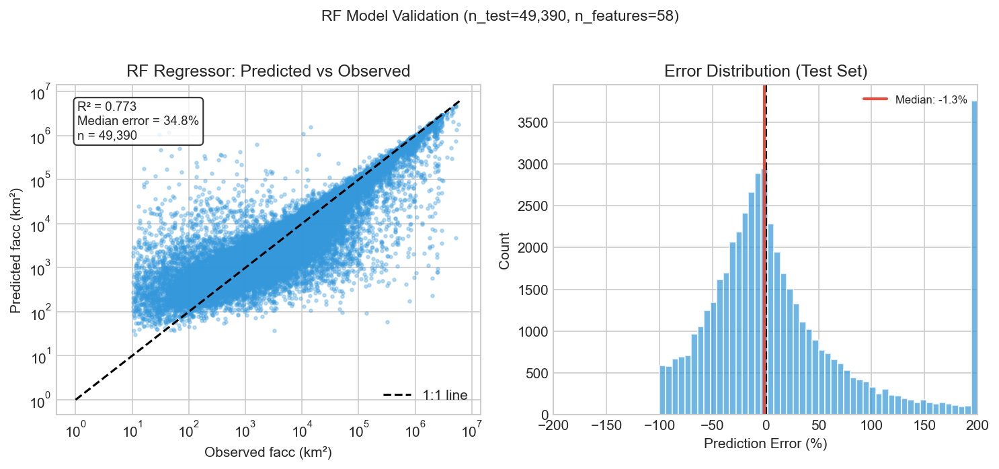
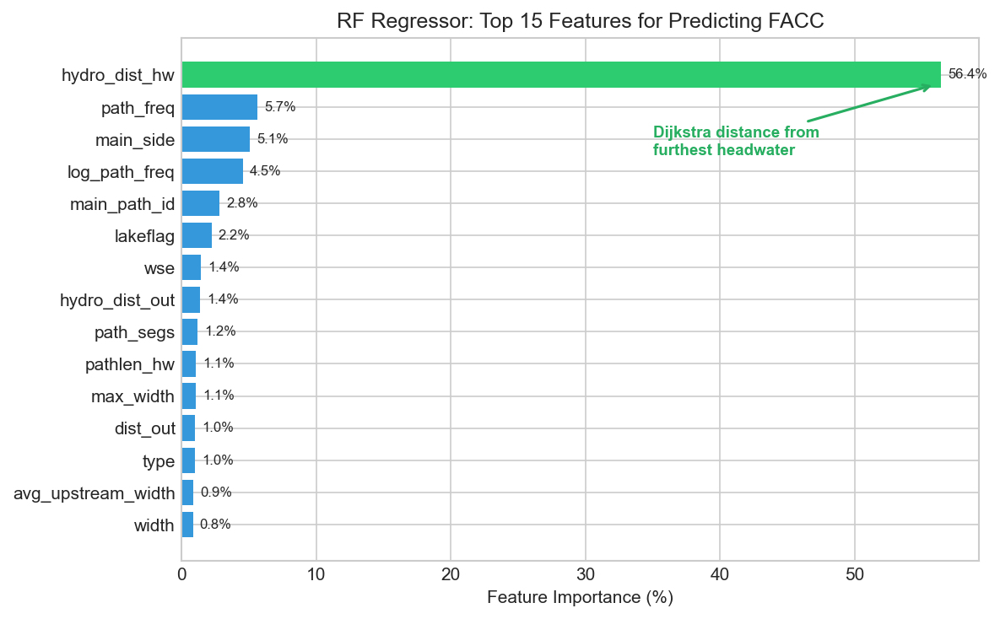
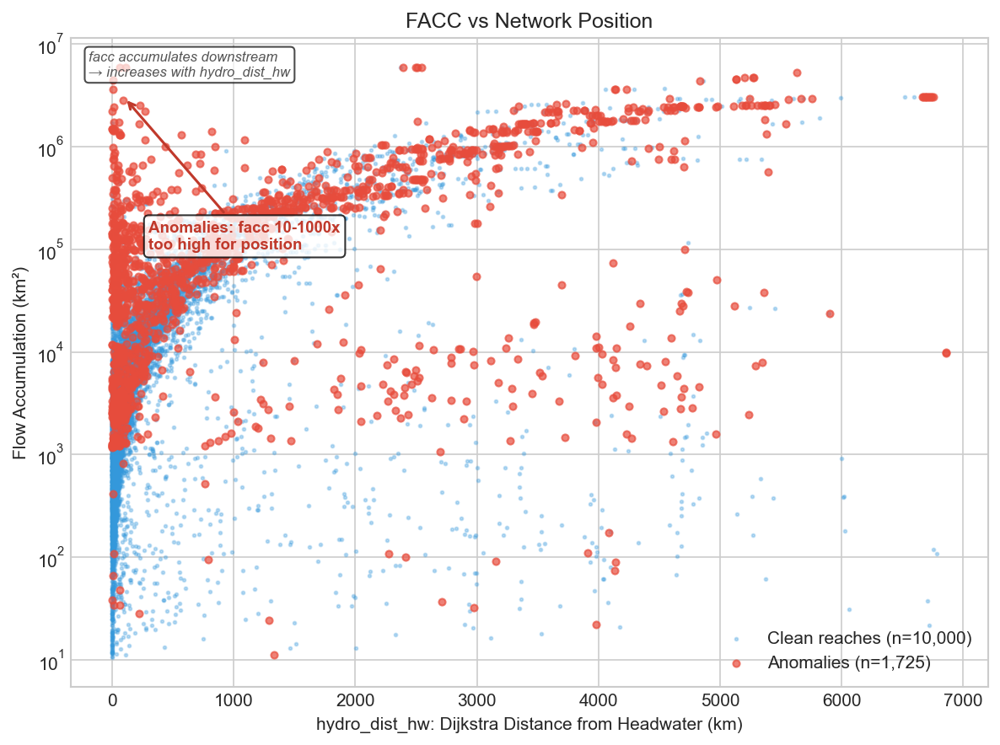
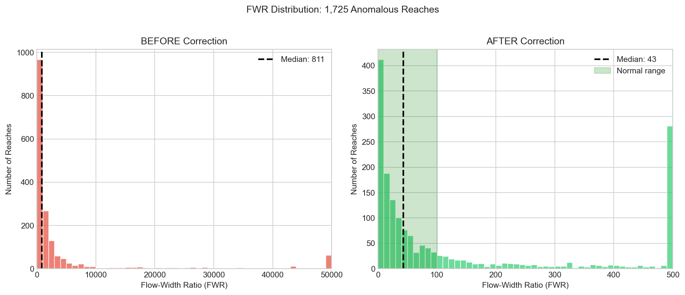

# FACC Error Detection and Correction

## The Problem

SWORD reach geometries come from GRWL (satellite-derived centerlines). Flow accumulation (facc) comes from MERIT Hydro (DEM-derived flow network). **These are independent datasets with different geometries.**

When SWORD reaches are assigned facc values from MERIT Hydro:
1. **Spatial mismatch:** SWORD centerlines don't perfectly align with MERIT flow paths
2. **Topology differences:** SWORD may have channels that MERIT doesn't recognize (or vice versa)
3. **D8 routing artifacts:** At bifurcations, MERIT's D8 algorithm routes ALL flow down one branch

**Result:** ~1,725 reaches have facc values 10-1000x too high - they got assigned facc from the wrong MERIT Hydro cell or inherited flow meant for a different channel.

---

## Detection: How We Found Them

### Key Metrics

**1. Flow-Width Ratio (FWR)**

```
FWR = facc / width
```

| Channel Type | Normal FWR |
|--------------|------------|
| Main channel | ~44 |
| Side channel | ~7 |
| Secondary outlet | ~1 |

Anomalous reaches have FWR of 2,000-75,000.

---

**2. Ratio to Median (facc vs network position)**

```
facc_per_reach = facc / path_freq
ratio_to_median = facc_per_reach / regional_median
```

`path_freq` is a traversal count that increases toward outlets - essentially "how many upstream reaches flow into this point."

- **Normal:** ratio_to_median = 0.5-2.0
- **Anomaly:** ratio_to_median = 40-1000+

This catches reaches with facc way too high for their network position.

---

**3. Upstream Sum Comparison**

```
facc vs SUM(upstream_facc)
```

At confluences, a reach's facc should roughly equal the sum of its upstream tributaries. If `facc > 3× upstream_sum`, the reach grabbed facc from the wrong MERIT cell.

### Detection Rules (11 total, 1,725 anomalies)

| Rule | Count | % | Criteria | Rationale |
|------|-------|---|----------|-----------|
| fwr_drop | 815 | 47.2 | `fwr_drop > 5 AND FWR > 500` | Bad facc doesn't propagate - FWR returns to normal downstream |
| entry_point | 466 | 27.0 | `facc_jump > 10 AND ratio_to_median > 40` | Sudden facc jump + FWR way above peers = bad facc entered |
| extreme_fwr | 200 | 11.6 | `FWR > 15,000` | Physically impossible - even Amazon is ~2,000 |
| jump_entry | 99 | 5.7 | `path_freq ≤ 0 AND facc_jump > 20 AND FWR > 500` | Disconnected reach shouldn't have significant drainage |
| upstream_fwr_spike | 40 | 2.3 | `upstream_FWR/this_FWR > 10 AND facc > 100K` | Bad facc entered upstream and propagated down |
| impossible_headwater | 30 | 1.7 | `path_freq ≤ 2 AND facc > 1M AND (fwr_drop > 2 OR FWR > 5000)` | Near-headwater can't have continental drainage |
| invalid_side_channel | 27 | 1.6 | `path_freq = -9999 AND main_side = 1 AND facc > 200K AND fwr_drop > 3` | Disconnected side channel grabbed mainstem MERIT cell |
| high_ratio | 17 | 1.0 | `ratio_to_median > 500 AND (fwr_drop > 2 OR no downstream)` | facc 500x above expected for network position |
| side_channel_misroute | 15 | 0.9 | `main_side = 1 AND fwr_drop > 20 AND facc > 100K` | Side channel routed through mainstem MERIT cell |
| facc_sum_inflation | 12 | 0.7 | `n_rch_up ≥ 2 AND facc > 3×sum(upstream)` | Mass balance violation at confluence |
| headwater_extreme | 4 | 0.2 | `n_rch_up = 0 AND facc > 500K AND FWR > 5,000` | True headwater can't have accumulated 500K+ km² |

---

## Correction: How We Fixed Them

### RF Regressor Approach

Train Random Forest on **clean reaches** to predict what facc SHOULD be based on network position.

**Training:** 247,000 clean reaches (all non-anomalous)
**Target:** Predict facc from 59 topology/position features
**Excludes:** Any feature derived FROM facc (to avoid circularity)


### Why This Works

Facc = cumulative drainage area. Drainage accumulates as you move downstream. Therefore:

```
farther from headwater → more accumulated drainage → higher facc
```

The RF model learns: **"at this network position, facc should be approximately X"**

When it sees an anomalous reach at `hydro_dist_hw = 150 km` with `facc = 2,500,000 km²`, it knows that's wrong because other reaches at similar positions have facc ~5,000 km².

### Model Performance

| Metric | Value |
|--------|-------|
| R² | 0.77 |
| Median % error | 35% |
| Training samples | 247,000 |
| Features used | 59 |



### Top Predictive Features



| Feature | Importance | Description |
|---------|------------|-------------|
| `hydro_dist_hw` | **56%** | Dijkstra distance from nearest headwater |
| `path_freq` | 6% | Network traversal count (increases toward outlets) |
| `main_side` | 5% | Channel type: 0=main, 1=side, 2=secondary |
| `log_path_freq` | 5% | Log-transformed path_freq |
| `main_path_id` | 3% | Mainstem identifier |
| `lakeflag` | 2% | Lake/river/canal/tidal classification |
| `wse` | 1% | Water surface elevation |
| `hydro_dist_out` | 1% | Dijkstra distance to outlet |

**Key insight:** `hydro_dist_hw` alone explains 56% of variance - network position is the dominant predictor.

### Why hydro_dist_hw works (not dist_out)

| Variable | Algorithm | Direction |
|----------|-----------|-----------|
| `dist_out` (v17b) | BFS upstream from outlets | Decreases downstream |
| `hydro_dist_hw` (v17c) | Dijkstra downstream from headwaters | **Increases downstream** |

**hydro_dist_hw computation:**
1. Build directed graph from SWORD topology (nodes = reaches, edges = flow)
2. Identify headwaters (reaches with no upstream neighbors)
3. For each headwater, run Dijkstra downstream using `reach_length` as edge weights
4. For each reach, keep the **maximum distance from any headwater** that can reach it

**Why it predicts facc:**
- facc **accumulates downstream** from headwaters
- `hydro_dist_hw` **increases downstream** from headwaters
- They move in the **same direction**

`dist_out` moves opposite to facc, so it's less intuitive for prediction.

### Feature Categories (59 total)

| Category | Count | Examples |
|----------|-------|----------|
| Position/Topology | 10 | hydro_dist_hw, path_freq, dist_out |
| Channel Classification | 13 | main_side, lakeflag, is_mainstem |
| Width metrics | 8 | width, max_width, width_ratio_to_dn |
| SWOT observations | 14 | wse_obs_median, width_obs_mean |
| Other | 14 | wse, slope, reach_length, network |

### Anomalies vs Clean Reaches



Anomalies (red) have facc values 10-1000x higher than clean reaches at the same network position.

### Correction Results



| Metric | Before | After |
|--------|--------|-------|
| Median facc | 68,637 km² | 4,933 km² |
| Median FWR | ~1,000 | ~50 |
| Reduction | - | **14x** |

---

## Example Corrections

| reach_id | River | Before | After | Reduction |
|----------|-------|--------|-------|-----------|
| 62210000705 | Amazon side | 5,885,793 | 907 | 6,500x |
| 28311300405 | Niger delta | 3,591,099 | 276 | 13,000x |
| 14631000181 | Ngalanka | 378,700 | 1,733 | 219x |

---

## Validation

- **39 seed reaches** (known bad) used for validation
- **36/39 (92%)** detected by rules
- **5 missed** by rule-based detection (see below)

**Missed seeds** (propagation patterns too subtle for any method):
- 22513000171
- 44581100665
- 44581100675
- 34211700241
- 34211101775

### Known Issues

**3 false positives** (wrongly corrected):
- 77250000153 - mainstem reach
- 74300400575, 74300400565 - incorrectly flipped

**4 false negatives** (missed, now added as seeds):
- 62293100143, 62293100156, 62253000321, 62235900101

---

## Summary

| Step | Method | Result |
|------|--------|--------|
| **Detection** | Rule-based (FWR ratios) | 1,725 anomalies found |
| **Correction** | RF regressor (network position) | Median 14x reduction |
| **Validation** | 39 seed reaches | 92% recall |
